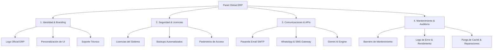

# Propuesta de Arquitectura: Panel de Configuración Global del ERP (Tenant Admin Portal)

Para ofrecer una experiencia **Premium de clase empresarial (estilo SAP Fiori / SAP BTP)**, la configuración del ERP debe dividirse claramente del Customizing comercial tradicional (como países, empresas o monedas). Este panel actuará como la consola de administración del sistema (System Administration Console) y estará estructurado de manera semántica, modular y escalable.

---

## 1. Organización Semántica y Estructura (Tabs Propuestas)

Proponemos estructurar el Panel de Configuración Global en **4 pestañas o bloques principales** que cubran las necesidades del sistema actuales y futuras:

### 📑 Tab 1: Identidad & Branding (Personalización Corporativa)
> [!NOTE]
> Configura la apariencia general y el canal de comunicación técnica por defecto del ERP.
* **Logotipo del ERP Oficial:** URL y selector para subir el logotipo general de la plataforma. Este logo se mostrará en el **Launchpad**, la barra superior (**Shellbar**) y las vistas consolidadas del holding.
* **Título del Sistema:** Nombre del ERP configurable (ej. *WorldClass ERP*). Sobrescribe el título de la pestaña del navegador y la barra principal.
* **Contacto de Soporte Técnico:** Dirección de correo de soporte (ej. `soporte@worldclass.com`) y enlace a la mesa de ayuda.
* **Tema y Color Acentuado:** Selector de color primario para la interfaz general del ERP (para unificar módulos).

### 📑 Tab 2: Seguridad & Licenciamiento (Gestión del Sistema)
* **Licencia de Uso:** Estado de la suscripción, fecha de expiración, límite de usuarios concurrentes y llave de activación (License Key).
* **Copias de Seguridad (Backups):**
  * Activación de respaldos automáticos (Diario/Semanal).
  * Carpeta de Google Drive destino de los respaldos del archivo principal de Excel.
  * Botón manual *"Generar Backup Instantáneo"*.
* **Administrador del Sistema:** Correo electrónico del super-administrador del Tenant y logs de acceso de seguridad.

### 📑 Tab 3: Integraciones & APIs (Conectores Externos)
* **Motor de Correo (Email Gateway):** Configuración de cuenta emisora por defecto (Gmail del sistema, SMTP personalizado, puerto, usuario y contraseña cifrada).
* **Motor de Inteligencia Artificial (AI Engine):**
  * Clave de API de Google Gemini.
  * Selección de modelo activo (ej. *Gemini 1.5 Pro* para análisis complejo, *Gemini 1.5 Flash* para tareas de alta velocidad).
  * Prompts de comportamiento globales del ERP.
* **Motor de Mensajería (WhatsApp/SMS):** API Key de proveedor, número de teléfono emisor y plantillas de notificación aprobadas.

### 📑 Tab 4: Mantenimiento & Diagnóstico (Operación del Sistema)
* **Sistema de Banners de Mantenimiento:**
  * Editor de mensajes del banner (ej: *"El sistema estará en mantenimiento programado hoy a las 22:00 hrs"*).
  * Nivel de gravedad (Info/Celeste, Advertencia/Amarillo, Crítico/Rojo).
  * Interruptor para Activar/Desactivar visualización global en todos los usuarios.
* **Visor de Logs y Errores:** Grilla interactiva con los últimos 50 errores de servidor registrados, detallando función, mensaje y fecha.
* **Herramientas de Soporte:** Purga manual de caché en memoria y botón para reparar claves/IDs desalineados en las tablas.

---

## 2. Experiencia de Usuario Premium (Estilo SAP Fiori)

Para que el diseño se sienta premium e integrado al ecosistema SAP Fiori actual:
* **Layout de Cabecera Persistente (Header block):** Muestra el estado del sistema (*Online, Licencia Activa, Último Backup Exitoso*) como KPI Tiles de lectura rápida antes de las pestañas.
* **Barra de Pestañas Icónica (Icon Tab Bar):** Pestañas horizontales limpias con iconos Lucide y micro-animaciones al alternar secciones.
* **Guardado Centralizado Fiori (Footer Toolbar):** Una barra inferior flotante y fija que aparece únicamente cuando el formulario ha sido modificado, con botones claros de *"Guardar Cambios"* e *"Descartar"*.
* **Controles Flexibles:** Interruptores deslizados (`switches`) en lugar de casillas de verificación simples (`checkboxes`), y selectores estilizados para carga de ficheros.

---

## 3. ¿Qué más podemos añadir? (Mejores Prácticas de Mercado)

1. **Gestión de Sesiones Concurrentes:** Un monitor que muestre cuántas personas tienen abierta la aplicación en tiempo real (métrica de uso).
2. **Selector de Entorno (Environment Marker):** Indicador visual en la barra superior (ej: etiqueta de estado `DEV`, `QAS` o `PROD`) para evitar errores humanos cuando los administradores configuran parámetros.
3. **Programador de Tareas (Cron scheduler):** Panel para definir horas en las que se envían correos automáticos o alertas (ej. alertas de nómina, seguimiento de leads inactivos).
